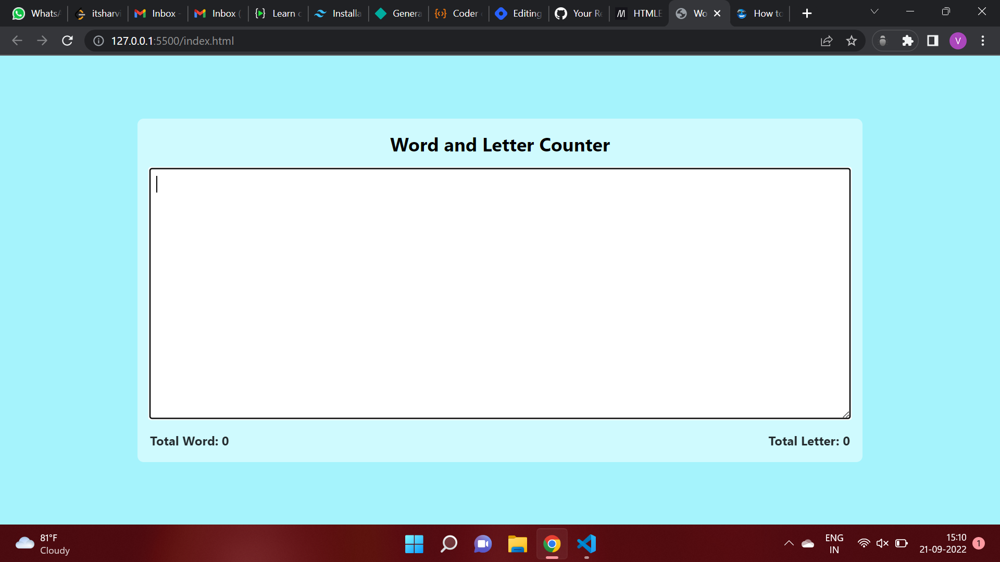

# **Word and Letter Counter App**
## **Overview**
This is a simple word and letter calculator which calculates the number of words and letters you have written in the text box.  It will automatically updates the word and letters count as you are entering or deleting the data from the text box.

## **Technology Used**
1. HTML
2. Tailwind CSS
3. JavaScript

## **Output**

## **Live Link**
